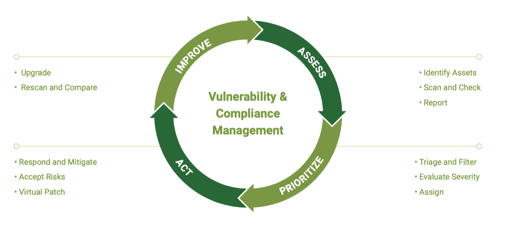
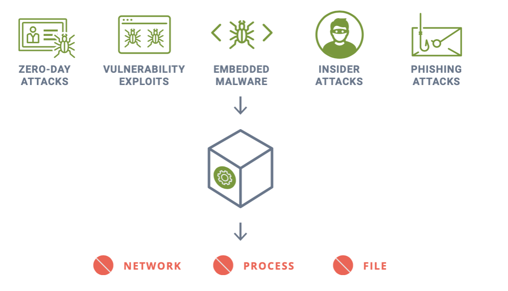

# automatingContainerSecurity

# 10 Steps to Automating Container Security Into the CI/CD Pipeline

## Introduction

The blog [Ten Steps to Automate Container Security](https://github.com/IBM/TenStepstoAutomateContainerSecurity-Blog) introduced readers to the reasoning behind why developers should prioritize container security in their CI/CD pipelines.  Developers should be familiar with the fact that CI/CD references the combined practices of continuous integration and either continuous delivery or continuous deployment.  It creates a bridge between the role and responsibility of development and operations by enforcing automation in application building, testing and deployment.  A CI/CD pipeline helps to automate the software delivery process. It builds code, runs tests (e.g. the continuous integration), and then safely deploys a new version of your application (e.g. continuous deployment).  Developers should take advantage of automated pipelines because it results in the removal of manual errors, standardized feedback looks and fast product iterations.

You will learn about the integration points that guide a DevOp through container security.  While containers using Kubernetes or Docker are nothing new, not all DevOps may know how to design and build these type of images that ensure container security. The flexibility of containers creates security challenges for developers. If you or your team is ulitizing software containers, you’ll want to learn about automating the process for ensuring best security practices.

While DevOps are rapidly becoming experts on automated CI/CD pipelines and how to manage orchestration tools such as Kubernetes, they often lack the understanding and experience of security technologies and best practices in production environments required to fend off the constant attacks on the infrastructure and applications.

## Who Should Implement These Steps?

We are taking a simplified view of two important roles when it comes to taking responsibility of the ten steps for automating container security. The two are:

* **DevOps (which includes DevSecOps)**: in addition to having some security responsibilities, this group also executes best practices in production environments to fend off attacks on the infrastructure and applications

* **Security**: need to handle the security of modern orchestration tools such as containers and Kubernetes

You will now learn what the 10 steps are. Know that in general, steps (1-4) are typically handled by DevOps and Compliance teams, while steps (8-10) are the responsibility of Operations and Security teams.  The middle steps (5-7) are the bridge between the CI/CD pipeline and the production environment with Security Policy as Code and Admission Controls being managed by the DevOps teams with oversight from the Security team.

# End-to-End Vulnerability and Compliance Management

End-to-End vulnerability management should follow the Assess, Prioritize, Act and Improve workflow as shown below:

## Step 1: Build-Phase Vulnerability Scan Triggers

* Use plug-ins, extensions, or REST API’s to enforce scanning during image builds to catch vulnerable images early in the pipeline. 

* Alerts for critical vulnerabilities discovered should go to the compliance management team and potentially the developer responsible for the image. These can be filtered to only alert and fail the build if there is a fix available for the vulnerability. If the image is annotated with the developer name alerting becomes easier and more accurate. 

## Step 2: Automated Registry Scans

* Continuously monitor images in each registry being used for staging and production environments. Layered scan results can make it easier for developers to find the vulnerable package or library by examining the build commands for each layer. Images can also be annotated with the developer or team responsible to make alerting or reporting easier.

* Alerts can be handled similarly to build-phase scans where only critical vulnerabilities with fixes available are sent to developers for remediation. If the image is annotated with the developer name alerting becomes easier and more accurate. While analyzing and alerting should be automated, some manual processes may be required initially until integration is tested and completed.

## Step 3: Run-Time (Production) Scanning & Auditing

* Auto-scan all running containers, hosts, and orchestrators. Any new containers, scaled up nodes, or updated orchestrator versions should be immediately scanned.

* Run CIS-benchmarks and custom compliance checks continuously.

* Enforce industry compliance requirements such as firewall and segmentation for PCI and other privacy standards. See the sections later in this document on Security Policy as Code, Behavioral Learning, and Network Segmentation for ways to automate compliance for network firewall enforcement.

* Alerts for critical run-time vulnerabilities with fixes available as
well as certain CIS benchmarks such as containers running as root should be sent to the DevOps team for investigation.

## Step 4: Analyze, Triage, and correlate the 'Impact' of Vulnerabilities in Production

* Correlate vulnerabilities to images, containers, hosts. Assess which production assets are affected by critical vulnerability and compliance issues.

* Implement **Virtual Patching** to mitigate production risks. See [Special topics] section below for information on **Virtual Patching**.

* Alerts on unprotected assets with critical vulnerabilities should be sent to DevOps and security teams. Assets which have virtual patching applied can be downgraded or lowered in priority because they present a lower exploit.

# Security Policy as Code and Behavioral Learning

Automating vulnerability scanning is a great start for securing containers. What is even more challenging and important is automating the creation of security policies to protect application workloads in production. Run-time security policies, especially firewall rules, have up to now largely required manual configuration in legacy data center-based infrastructures.

However, in modern cloud deployments, the use of Kubernetes custom resources to declare an application security policy at any stage in the pipeline provides a solution to this problem.

Developers, DevOps, and Security teams can use custom resource definitions (CRDs) to automate and maintain run-time security policies. CRDs can also be used to enforce global security policies across multiple Kubernetes clusters.

Behavioral Learning is a useful technique to learn and characterize an application’s behavior to automatically draft the security policy CRD. This CRD can then be reviewed by Dev, DevOps and Security teams and edited as needed, then signed off as the security policy for the application. This CRD ‘code’ can then be checked into the change management system before it is deployed into production.

## Step 5: Security Policy as Code and Behavioral Learning

* Capture the ‘allowed’ application behavior in standard CRD yaml files. Behavior should include allowed network connections and protocols including ingress/egress, processes, and file access activity. Security policies that are not tied to specific applications such as global security rules can also be expressed in separate CRDs.

* Build review, approval, and check-in steps into the pipeline so the security policy as code represents the ultimate authority for production security rules.

* Deploy the security policy CRDs into the production environment before the new or updated applications are deployed, thereby ensuring the new workloads are secured from the moment they start running.

## Step 6: Use Behavioral Learning to Automate Security Policy

* In the test, QA, and/or staging environments, run the applications and their associated test suites and use behavioral learning to capture allowed application behavior in the form of network, process, file and other security rules.

* Export the rules as a CRD for review and use in Step 5 above.

# Complete Run-Time Protection

Once they are running in production, containers, their hosts, and the orchestrator need to be protected against attacks. Complete run-time protection should include container process and file access controls, host monitoring, and most critically, network security with deep packet inspection. In the past, network firewall rules and endpoint security policies required heavy manual customization, but this can’t be required for modern automated pipelines.

Run-time security starts with admission controls as a gatekeeper for the production environment, and progress through run-time scanning and compliance checks to real-time attack prevention.

## Step 7: Use Admission Controls to Prevent Vulnerable or Unauthorized Deployments

* Use criteria such as vulnerability scan results, namespaces, registries, and container properties (e.g. running as root) to control deployments.

* While creation of these rules can be automated or manual, enforcement and alerting should be automated.

## Step 8: Deploy a Layer8 Container Firewall for Automated Segmentation and Threat Detection

* Automate blocking, quarantine, packet capture, and alerting for network attacks and segmentation violations.

* Use Security Policy as Code to automate rule creation and updates

## Step 9: Use Endpoint Security Controls for Containers and Hosts

* Automate blocking and alerting for suspicious process and file activity in containers and hosts.

* Use Security Policy as Code to automate rule creation and updates.

# Alerting, Response, & Forensics

Many automations in this step are fairly well understood and implemented for other infrastructures. For example, event reporting to SIEM systems for alerting and forensic capture. In a container-based environment, some things are more difficult, such as initiating packet captures only on suspicious containers. Or correctly identifying the pod, namespace or application service by its Kubernetes deployment name, in order to investigate where an attack is occurring.

## Step 10: Automate Alerting and Real-time Responses

* Generate special alerts for critical security events.

* Quarantine suspicious containers.

* Initiate packet captures for investigation and forensics.

* Integrate with case management tools to address security and compliance violations.

# Special Topics

## What is Virtual Patching

Virtual Patching enables security teams to ‘virtually patch’ a vulnerability in a running container or host, without needing to update or replace the running asset with a patched version. It essentially protects the running asset (container, host etc.) against an attempted exploit of the vulnerability.

The best way to do this is to automatically characterize and whitelist all application container behavior such as network connections, processes, and file activity, then lock it down. The workload or host are then ‘virtually patched,’ and any attempted exploit will create an unauthorized network connection, process, or file access which can be blocked.

Virtual patching protects against vulnerability exploits, embedded malware, zero-day attacks, and insider & phishing attacks.

## What is Container Network Segmentation

[NeuVector](https://neuvector.com/), who builds full lifecycle container security, provides a true cloud-native Layer 7 [container firewall](https://neuvector.com/solutions/run-time-container-security/) which does network segmentation automatically. Layer 7 is the application-level communication layer in the OSI network model. In networking, communication between services happens at multiple layers, ranging from the physical/hardware layer all the way to the application layer. Layer 7 is used as shorthand for the communication layer that is closest to the user. Layer 7 protocols include HTTP, gRPC, and applications-specific protocols such as Redis and Kafka.  Developers can access the service, NeuVector, on the [Red Hat Marketplace](https://marketplace.redhat.com/en-us/products/neuvector-operator). By using behavioral learning, connections and the application protocols used between services are discovered and whitelist rules to isolate them are automatically created. This means that container segmentation is easy and automated, without requiring knowledge of connections beforehand or the manual creation and maintenance of segmentation rules.  With a cloud-native, Layer 7 container segmentation solution, workloads can be segmented even if they are running on the same host or in the same cluster. This is especially valuable to fulfill industry standard compliance requirements such as PCI DSS.

## The Ultimate Cloud Security Pattern - Container Segmentation

Ultimately, to give the business the most flexibility for rapid release and optimal resource utilization, container segmentation must be enforced on each pod and follow application workloads as they scale and move dynamically. In this [micro-perimeter vision article](https://neuvector.com/cloud-security/container-security-micro-perimeters/), NeuVector CTO Gary Duan outlines a vision for cloud security where the protection perimeter surrounds the workload even as it moves across hybrid clouds.

# Summary

## Take the Steps now to Automate Security

The road to a fully automated pipeline with integrated security controls all the way into production starts with a few easy first steps. Which of the ten steps in this document you start with depends on where you are in the process of automating your pipeline. What is most important is to get started with what can be done easily and what is most critical at this time, then create a roadmap to fully automated security. For example, build-phase and registry scanning is fairly easy to automate and delivers good value in return. Automated run-time security responses such as alerting, blocking, quarantine and packet capture are also easy to enable. In contrast, requiring Security Policy as Code can be more complicated, from both a technical creation and workflow testing perspective as well as a human process perspective. To be successful, DevOps and Security teams need to agree on roles, responsibilities, pipeline processes, and the role that developers play in deploying security policy as code. The good news is that implementing even a small subset of the steps outlined in this guide will improve pipeline automation and move organizations towards the goal of pipeline automation with security integration.

